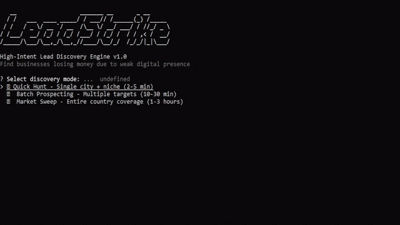

<div align="center">

<br/>


# LeadStrike

### High-Intent Lead Discovery Engine

**Find businesses losing money right now and sell them the solution.**

<br/>

[](https://github.com/diegosantdev/leadstrike)
[](LICENSE)
[](https://nodejs.org)
[](https://developers.google.com/maps/documentation/places/web-service/overview)

<br/>



<br/>

</div>

## What is LeadStrike?

LeadStrike is a **revenue intelligence engine** that detects the gap between a business's reputation and its digital presence. When that gap is large, the opportunity is real.

```
Reputation (reviews + rating)  −  Visibility (website + SEO + presence)
                                =  Opportunity score
```

> High reputation + weak digital presence = a business **actively losing customers** it doesn't know about.

Instead of generating contact lists, LeadStrike finds **companies already losing money and ready to buy.**

## Quick Start

```bash
npm install
cp .env.example .env
npm start
```

```env
# .env
GOOGLE_PLACES_API_KEY=your_key_here
```

## Opportunity Scoring

Each lead is scored 0–100 based on the gap between trust signals and digital weakness.

| Score | Label | Meaning |
|-------|-------|---------|
| 🔥 80–100 | **HOT** | Losing money now act fast |
| 🟡 60–79 | **WARM** | Revenue leak detected |
| ⚪ < 60 | **COLD** | Low urgency |

### Scoring factors

| Factor | Weight |
|--------|--------|
| Digital weakness (no website, no SEO) | 40 pts |
| Reviews volume | 30 pts |
| Rating quality | 25 pts |
| Contact info available | 20 pts |
| Active business status | 10 pts |

## Modes

### ⚡ Quick Hunt
Fast discovery for a single city and niche.
```
Dentists in New York → 5–15 HOT leads
```

### 📦 Batch Prospecting
Multiple cities and niches in a single run.
```
Gyms in top 5 US cities → 50–100 leads
```

### 🌍 Market Sweep
Full country scan for maximum coverage.
```
Restaurants in Brazil → 500+ leads
```

## Output

```json
{
  "business_name": "Smile Dental",
  "rating": 4.8,
  "reviews": 247,
  "website": null,
  "phone": "+1 (212) 555-0192",
  "score": 89,
  "category": "HOT"
}
```

```bash
$ npm start

🔥 Found 12 HOT opportunities
→ Smile Dental        Score: 89
→ BrightCare Clinic   Score: 84
→ City Gym Pro        Score: 81
```

## Coverage

**17 countries:** US · BR · CA · UK · AU · DE · FR · ES · IT · NL · PT · MX · AR · SG · AE · JP · IN

**65+ niches across:**

- 💼 Professional Services
- 🏥 Healthcare
- 💅 Beauty & Personal Care
- 💪 Fitness & Wellness
- 🍽️ Food & Beverage
- 🏗️ Construction & Trades
- 🚗 Automotive
- 🏪 Retail
- 🏨 Hospitality
- 🎓 Education

## Why LeadStrike

| Traditional approach | LeadStrike |
|----------------------|------------|
| Generic lead lists | Scored opportunity engine |
| Cold outreach with no context | Context-aware, pain-point targeting |
| Low conversion rates | High-intent prospects |
| Manual research required | Automated gap detection |

## Use Cases

**Agencies** Find clients actively losing revenue. Walk in with the problem already diagnosed.

**SEO & Freelancers** Surface invisible demand. These businesses need exactly what you offer, they just don't know it yet.

**SaaS founders** Identify ideal customers by detecting the exact pain your product solves.

## Project Structure

```
LeadStrike/
├── src/
│   ├── cli.js
│   ├── index.js
│   ├── config/
│   ├── engines/
│   ├── services/
│   └── exports/
└── library/
    ├── leadstrike.png
    └── demo.gif
```

## Environment

```env
GOOGLE_PLACES_API_KEY=your_key_here
```

Get a key at [console.cloud.google.com](https://console.cloud.google.com) enable the **Places API**.

---

<div align="center">

**LeadStrike is not a scraper.**
It's a revenue intelligence engine.

<br/>

Made by [@diegosantdev](https://github.com/diegosantdev) · [MIT License](LICENSE)

</div>